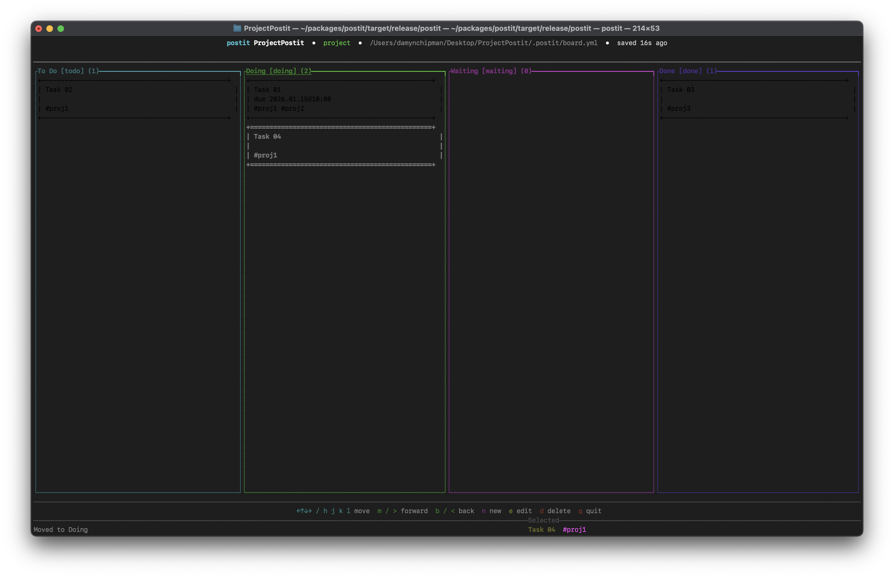

# postit

`postit` probably stands for something like "Productivity-Oriented Sticky-Task Iteration Terminal" or "Pretentiously Overengineered Sticky-Note Task Integration Tool." Basically, it's a "sticky note" task management system in a TUI.

It's how I like to get crap done...

This project is 100% vibe coded!

## Install & Build
- Build locally: `cargo build --release`
- Run from source: `cargo run --`
- Install to `$HOME/.cargo/bin`: `cargo install --path .`

## Usage
Run `postit` in a directory with (or without) a `.postit/board.yml`; it will create/use a board and open the full-screen TUI. Subcommands remain available (e.g., `postit list`, `postit add ...`), but default is the TUI.

### TUI Controls
- Navigation: `h/j/k/l` or arrows
- Move note between columns: `m` or `>` (forward), `b` or `<` (back)
- Add: `n`
- Edit: `e`
- Delete: `d` (with confirmation)
- Quit: `q`
- In forms: `Tab` / `Shift+Tab` to move fields; arrows move cursor; `Enter` adds newline in Body; `Ctrl+Enter` saves; `Esc` cancels

### Due Dates
Use `YYYY.MM.DD@hh:mm` (e.g., `2024.12.31@09:30`). Dates display in the same format throughout CLI and TUI.

## Data
Boards live in `.postit/board.yml` under your project; if none is found, a global board is used. Data is plain YAML for easy editing and versioning.
